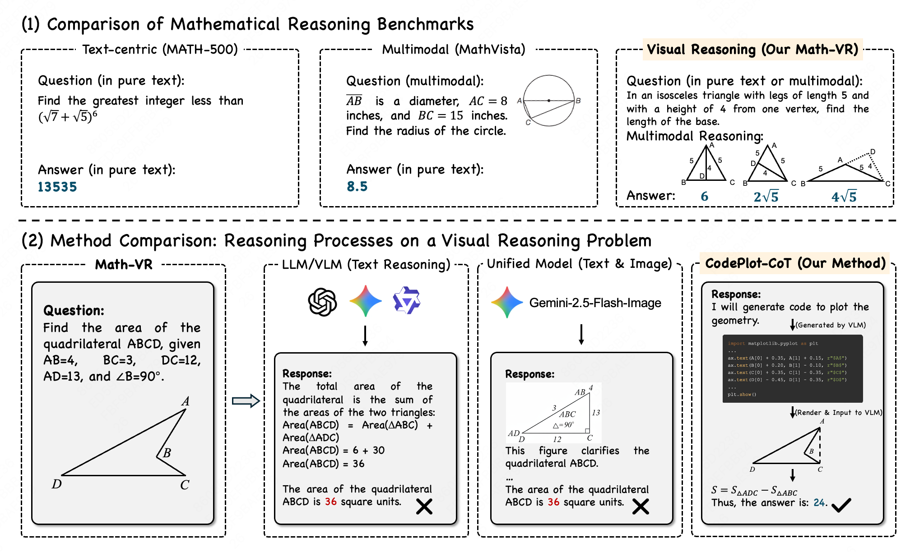
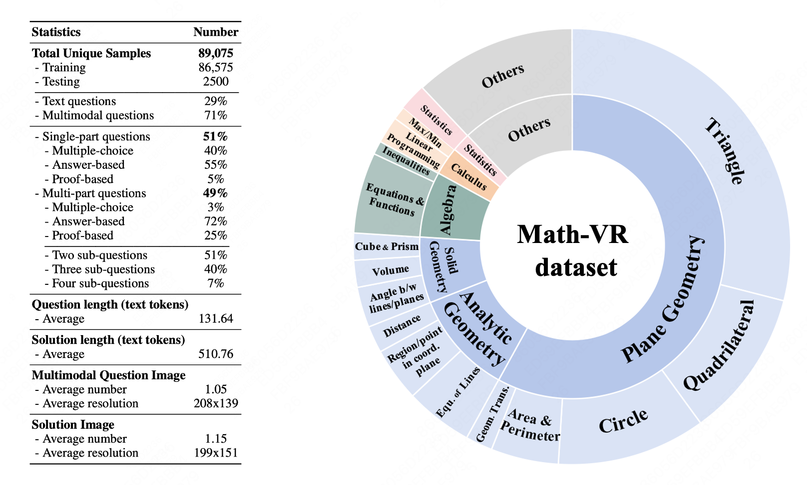
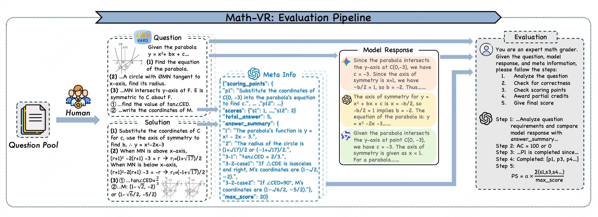
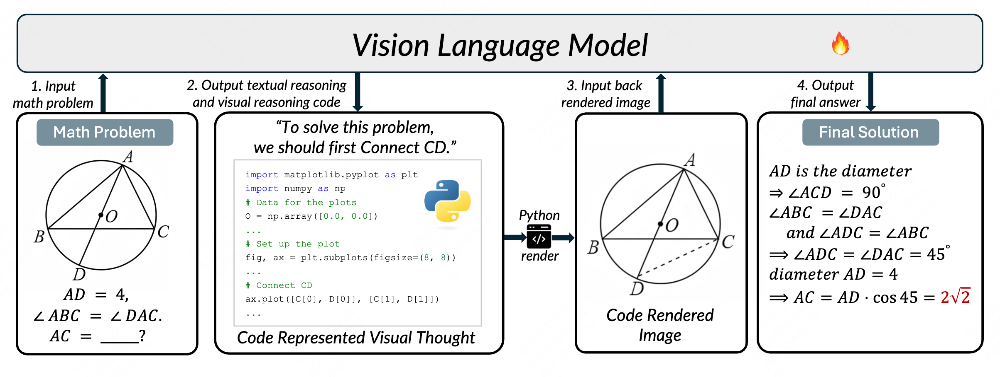

# Math-VR Benchmark & CodePlot-CoT: Mathematical Visual Reasoning by Thinking with Code-Driven Images
<div align="center">
<a href=""></a>
<a href=""></a>

  
[Chengqi Duan](https://scholar.google.com/citations?user=r9qb4ZwAAAAJ&hl=zh-CN)<sup>1\*</sup>, [Kaiyue Sun](https://scholar.google.com/citations?user=mieuBzUAAAAJ&hl=zh-CN&oi=ao)<sup>1\*</sup>, [Rongyao Fang](https://scholar.google.com/citations?user=FtH3CW4AAAAJ&hl=en)<sup>3\*</sup>, [Manyuan Zhang](https://manyuan97.github.io/)<sup>2†</sup>, [Yan Feng](https://scholar.google.com/citations?user=m4f3F4cAAAAJ&hl=en)<sup>2</sup>, [Ying Luo](https://scholar.google.com/citations?hl=en&user=-VlvW5IAAAAJ)<sup>2</sup>, [Yufang Liu](https://scholar.google.com/citations?hl=en&user=0V2WCSIAAAAJ)<sup>2</sup>, [Ke Wang](https://scholar.google.com/citations?user=woY4bS8AAAAJ&hl=zh-CN&oi=sra)<sup>3</sup>, [Peng Pei](https://www.linkedin.com/in/peng-pei-7584a839/)<sup>2</sup>, [Xunliang Cai](https://maimai.cn/contact/share/card?u=fudmdwckxlwi)<sup>2</sup>, [Hongsheng Li](https://www.ee.cuhk.edu.hk/~hsli/)<sup>3</sup>, [Yi Ma](https://scholar.google.com/citations?user=XqLiBQMAAAAJ&hl=zh-CN&oi=ao)<sup>1</sup>, [Xihui Liu](https://xh-liu.github.io/)<sup>1 :envelope:</sup>

<sup>1</sup>HKU, <sup>2</sup>Meituan, <sup>3</sup>CUHK

\*Equal contribution, †Project Lead , :envelope:Corresponding authors
</div>

<div align="center">
  
  
</div>
<hr>
<div align="center" style="line-height: 1.2;">
  <a href="" target="_blank"><b>Paper</b></a> •
  <a href="#introduction">Introduction</a> •
  <a href="#math-vr">Math-VR</a> •
  <a href="#model-overview">Model</a> •
  <a href="#usage">Usage</a> •
  <a href="#math-vr-benchmark-evaluation">Evaluation</a> •
  <a href="#benchmark">Benchmark results</a> •
  <a href="#license">License</a> •
  <a href="#citation">Citation</a>
</div>

## Introduction

Recent advances in Vision Language Models (VLMs) have shown significant progress in mathematical reasoning, yet they still face a critical bottleneck with problems that require visual assistance, such as drawing auxiliary lines or plotting functions. Most VLMs are constrained to text-only reasoning, while unified models that generate interleaved text and images often lack the precision required for mathematical tasks.

We present **CodePlot-CoT**, a code-driven Chain-of-Thought (CoT) paradigm that enables models to "think with images" in mathematics. Our approach leverages a VLM to generate both textual reasoning and executable plotting code. This code is then rendered into an image, serving as a "visual thought" that is reinput into the model to aid in problem solving. To facilitate this, we introduce **Math-VR**, the first large-scale, bilingual dataset and benchmark for mathematical problems requiring visual reasoning, comprising 178K samples. We also developed **MatplotCode**, a specialized image-to-code converter to generate high-quality training data. We benchmark SOTA models on our Math-VR . Our experiments show that CodePlot-CoT achieves up to a 21% performance increase over its base model, demonstrating the effectiveness of our code-driven reasoning paradigm.

The main contributions of our work can be summarized as follows:
* We propose a novel and efficient paradigm that enables VLMs to engage in visual reasoning through code generation.
* We construct **Math-VR**, the first large-scale, bilingual dataset and benchmark (178K samples) for Mathematical problems with Visual Reasoning.
* We develop **MatplotCode**, a state-of-the-art image-to-code converter for mathematical figures, and train **CodePlot-CoT** model, a specialized model that achieves up to a 21% performance increase over strong baselines.


## Released Data: Math-VR-train and Math-VR-bench
| Dataset         | Link                                                        |
|---------------|-------------------------------------------------------------|
| **Math-VR-train** | [🤗 HuggingFace](https://huggingface.co/datasets/gogoduan/Math-VR-train) |
| **Math-VR-bench** | [🤗 HuggingFace](https://huggingface.co/datasets/gogoduan/Math-VR-bench) |

## Released Model: MatPlotCode and CodePlot-CoT

| Model         | Link                                                        |
|---------------|-------------------------------------------------------------|
| **MatPlotCode** | [🤗 HuggingFace](https://huggingface.co/gogoduan/MatPlotCode) |
| **CodePlot-CoT** | [🤗 HuggingFace](https://huggingface.co/gogoduan/CodePlot-CoT) |


## Math-VR

Math-VR is the first large-scale, bilingual (English and Chinese) dataset and benchmark specifically designed to evaluate and advance the visual reasoning capabilities of AI models in mathematics. While traditional benchmarks have focused on text-centric problem-solving, Math-VR targets the critical domain of problems that require "reasoning with images," such as drawing auxiliary lines or plotting functions to find a solution.

Math-VR dataset contains 178,000 samples, each consisting of a question, a detailed reasoning process, and a final answer. A key feature of this dataset is that the reasoning process for each problem includes at least one image, providing a rich resource for training models to integrate visual information into their problem-solving steps. The dataset spans multiple mathematical domains, including Geometry, Algebra, and Calculus.

Math-VR benchmark comsists of 5,000 bilingual (English and Chinese) mathematical questions. To ensure a deterministic and reliable evaluation, questions were carefully selected; for instance, proof-based questions were excluded to avoid the difficulty of assessing logical validity, and most multiple-choice questions were removed to prevent correct answers from random guessing. The benchmark is divided into two subsets: a **Text** subset with 2,000 text-only questions, and a **Multimodal** subset with 3,000 questions presented with both text and images. Both question types require models to reason or use imagination in the visual domain.We designed a comprehensive evaluation pipeline that uses two core metrics to measure a model's performance:
* **Answer Correctness (AC)**: This metric provides a reliable binary judgment by strictly checking whether the model's final answer perfectly matches the ground-truth answer. Any error or omission results in a score of 0.
* **Process Score (PS)**: Recognizing that the reasoning process can be valuable even if the final answer is incorrect, this metric awards partial credit. It assesses whether the model hits critical "scoring points"—such as applying theorems or performing necessary calculations—within its reasoning steps. This fine-grained assessment more accurately reflects a model's true problem-solving abilities.

<div align="center">
  
</div>

<div align="center">
  
</div>

## Model Overview
### CodePlot-CoT: Mathematical Visual Reasoning with Code-Driven Images

We introduce **CodePlot-CoT**, an innovative code-driven Chain-of-Thought (CoT) paradigm designed to enable Vision Language Models to "think with images" when solving mathematical problems. Rather than generating pixel-based images directly, the model outputs executable plotting code to represent its "visual thoughts". This code is executed to render a precise figure, which is then reinput to the model as a visual input for subsequent reasoning steps.

### MatplotCode: A High-Fidelity Converter for Mathematical Figures
To train the CodePlot-CoT model, we require high-quality data pairing images with corresponding plotting code. Since such resources are rare and existing general models are unreliable for this specialized task, we develope **MatplotCode**, a state-of-the-art image-to-code converter designed specifically for mathematical figures. It is specialized in converting complex mathematical figures into high-fidelity Python plotting code. In our evaluation, MatplotCode achieve a **100%** code execution success rate. Its image reconstruction fidelity is also significantly higher than SOTA models including GPT-03 and Gemini-2.5-Pro. MatplotCode is the key to enabling the large-scale curation of our code-driven training data, laying the foundation for the successful training of the CodePlot-CoT model.

<div align="center">
  
</div>

## Usage

### Installation
Clone the repo and install dependent packages.
```bash
conda create -n codeplot python==3.10
conda activate codeplot
git clone git@github.com:HKU-MMLab/Math-VR-CodePlot-CoT.git
cd CodePlot-CoT
pip install -r requirements.txt
pip install flash_attn==2.7.4.post1
```

### Model Weights
Expected directory structure might be:
```
CodePlot-CoT
├── ckpts
│   ├── CodePlot-CoT 
│   ├── MatPlotCode 
├── ...
```

### Inference
```python
# Convert image to python code with MatPlotCode
python image_to_code.py
# Solve math problems with CodePlot-CoT
python math_infer.py
```

## Math-VR Benchmark Evaluation

To evaluate model on the Math-VR benchmark, please follow these steps:

1.  Download the Math-VR benchmark [dataset](https://huggingface.co/datasets/gogoduan/Math-VR) from Hugging Face. This dataset contains our 2500 English test questions.
2.  Store the downloaded file in a `data/` directory.
3.  Create a JSON file containing model's solutions.
    * Please refer to `Math-VR-Infer.py` for guidance on the generation process. Specifically, if you only wish to evaluate on the text subset or multimodal subset, you can pass the `--type text` or `--type multimodal` to the infer script.
    * The answer file must be a JSON object mapping each `<question_id>` to model's corresponding solution string. An example is provided in `examples/answer.json`.

The required format for the answer file is as follows:
```python
{
  "<question_id>": "<Model's solution>",
  ...
}
```
4. Run the evaluation script with the following command: 
```bash
python Math-VR-Eval.py --answer_dir "<The Json file that contains model's solutions>" --result_dir "<The path to save the evaluation result in Json format>" --data_path "<The path to the benchmark dataset>" --api_key "<Your openai api key>"
```
The script leverages GPT4.1 to evaluate model's response and generates a result.json containing its judgement.
5. Summarize all scores by running:
```bash
python summarize_score.py --result_dir "<The path to the saved result>" --data_path "<The path to the benchmark dataset>"
```

## Benchmark
We benchmark a suite of SOTA VLMs, UMs and LLMs on Math-VR english subset with 2500 unique questions.
<details open>
<summary> Math-VR benchmark (English) on VLMs and UMs </summary>

| # | Model | Link | #Params | Type | Thinking | Text (PS) | Text (AC) | Multimodal (PS) | Multimodal (AC) | Overall (PS) | Overall (AC) |
|---|---|:---:|---|---|:---:|:---:|:---:|:---:|:---:|:---:|:---:|
| 1 | Gemini-2.5-Pro 🥇 |[Link](https://deepmind.google/models/gemini/pro/) | - | VLM | ✓ | 77.9 | 58.7 | 82.8 | 68.7 | **80.8** | **64.7** |
| 2 | Gemini-2.5-Flash 🥈 |[Link](https://deepmind.google/models/gemini/flash/) | - | VLM | ✓ | 77.5 | 57.0 | 79.0 | 62.9 | **78.4** | **60.5** |
| 3 | GPT-o3 🥉 |[Link](https://openai.com/index/introducing-o3-and-o4-mini/)| - | VLM | ✓ | 72.9 | 52.9 | 78.6 | 63.7 | **76.4** | **59.3** |
| 4 | Seed-1.6-Thinking |[Link](https://seed.bytedance.com/en/seed1_6)| - | VLM | ✓ | 73.0 | 53.0 | 76.6 | 62.0 | **75.2** | **58.4** |
| 5 | Nano Banana |[Link](https://aistudio.google.com/models/gemini-2-5-flash-image)| - | UM | X | 72.3 | 49.1 | 74.7 | 56.3 | **73.8** | **53.4** |
| 6 | Gemini-2.5-Flash-No-Thinking |[Link](https://deepmind.google/models/gemini/flash/)| - | VLM | X | 70.9 | 44.6 | 75.5 | 57.5 | **73.7** | **52.3** |
| 7 | GLM-4.5V |[Link](https://github.com/zai-org/GLM-V)| 108B | VLM | ✓ | 70.5 | 48.0 | 69.1 | 50.6 | **69.7** | **49.6** |
| 8 | Mimo-VL-7B |[Link](https://github.com/XiaomiMiMo/MiMo-VL)| 7B | VLM | X | 68.4 | 43.5 | 69.0 | 51.3 | **68.8** | **48.3** |
| 9 | InternVL-3.5-8B |[Link](https://huggingface.co/OpenGVLab/InternVL3_5-8B)| 8B | VLM | ✓ | 64.0 | 38.5 | 62.0 | 42.2 | **62.8** | **40.8** |
| 10 | GPT-4.1-mini |[Link](https://platform.openai.com/docs/models/gpt-4.1-mini)| - | VLM | X | 62.0 | 33.3 | 58.6 | 33.3 | **60.0** | **33.3** |
| 11 | GLM-4.1V-9B |[Link](https://github.com/zai-org/GLM-V)| 9B | VLM | ✓ | 54.4 | 27.8 | 52.7 | 29.9 | **53.4** | **29.0** |
| 12 | Claude-Sonnet-4 |[Link](https://www.anthropic.com/news/claude-4)| - | VLM | X | 60.9 | 31.5 | 53.4 | 25.8 | **56.4** | **28.1** |
| 13 | GPT-4.1 |[Link](https://platform.openai.com/docs/models/gpt-4.1)| - | VLM | X | 56.5 | 26.6 | 52.2 | 25.6 | **53.9** | **26.0** |
| 14 | **CodePlot-CoT** |[Link](https://huggingface.co/gogoduan/CodePlot-CoT)| 32B | VLM | X | 53.8 | 31.6 | 42.4 | 15.8 | **47.0** | **22.1** |
| 15 | Gemini-2.0-Flash |[Link](https://aistudio.google.com/prompts/new_chat?model=gemini-2.0-flash-exp)| - | VLM | X | 56.1 | 24.1 | 47.0 | 18.3 | **50.7** | **20.6** |
| 16 | Keye-VL-1.5 |[Link](https://github.com/Kwai-Keye/Keye)| 8B | VLM | X | 44.4 | 20.2 | 34.0 | 15.4 | **38.2** | **17.3** |
| 17 | Gemma3 |[Link](https://deepmind.google/models/gemma/gemma-3/)| 27B | VLM | X | 50.8 | 19.2 | 40.8 | 14.1 | **44.8** | **16.1** |
| 18 | Qwen-2.5-VL-72B |[Link](https://modelscope.cn/models/Qwen/Qwen2.5-VL-72B-Instruct)| 72B | VLM | X | 44.6 | 15.3 | 38.2 | 12.7 | **40.8** | **13.7** |
| 19 | Bagel-Zebra-CoT |[Link](https://github.com/multimodal-reasoning-lab/Bagel-Zebra-CoT)| 7B | UM | X | 41.5 | 13.9 | 29.1 | 7.6 | **34.1** | **10.1** |
| 20 | Qwen-2.5-VL-32B |[Link](https://modelscope.cn/models/Qwen/Qwen2.5-VL-32B-Instruct)| 32B | VLM | X | 36.9 | 10.6 | 31.5 | 9.6 | **33.7** | **10.0** |
| 21 | GPT-4.1-nano |[Link](https://platform.openai.com/docs/models/gpt-4.1-nano)| - | VLM | X | 45.9 | 13.1 | 33.6 | 6.4 | **38.5** | **9.1** |
| 22 | InternVL-3.5-8B-No-Thinking |[Link](https://huggingface.co/OpenGVLab/InternVL3_5-8B)| 8B | VLM | X | 35.6 | 9.2 | 28.6 | 7.0 | **31.4** | **7.9** |
| 23 | Bagel |[Link](https://github.com/ByteDance-Seed/Bagel)| 7B | UM | X | 32.9 | 8.5 | 24.0 | 7.0 | **27.6** | **7.6** |
| 24 | Qwen-2.5-VL-3B |[Link](https://modelscope.cn/models/Qwen/Qwen2.5-VL-3B-Instruct)| 3B | VLM | X | 33.4 | 7.9 | 23.6 | 3.6 | **27.5** | **5.3** |
| 25 | GPT-4o |[Link](https://platform.openai.com/docs/models/gpt-4o)| - | VLM | X | 34.6 | 5.7 | 27.6 | 3.4 | **30.4** | **4.3** |
| 26 | Qwen-2.5-VL-7B |[Link](https://modelscope.cn/models/Qwen/Qwen2.5-VL-7B-Instruct)| 7B | VLM | X | 18.0 | 4.5 | 11.0 | 2.0 | **13.8** | **3.0** |
</details>


<details open>
<summary> Math-VR benchmark (English) on LLMs </summary>

| # | Model | Link | #Params | Type | Thinking | Text (PS) | Text (AC)
|---|---|:---:|---|---|:---:|:---:|:---:|
| 1 | Deepseek-R1 |[Link](https://github.com/deepseek-ai/DeepSeek-R1)| 671B | LLM | ✓ | 69.9 | 49.5 |
</details>

### License
This code is released under the MIT License.

### Citation
If you find this work helpful, please consider citing our paper:
```
```

### Contact
If you have any questions, please raise an issue or contact us at [duancq24@connect.hku.hk](mailto:duancq24@connect.hku.hk).
