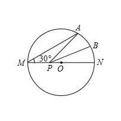

As shown, $MN$ is the diameter of circle $\bigodot O$ and the radius of $\bigodot O$ is 2. Point $A$ lies on $\bigodot O$ and $\angle AMN = 30^{\circ}$. $B$ is the midpoint of arc $AN$. $P$ is a movable point on the diameter $MN$. Find the minimum value of $PA + PB$: __________ .

