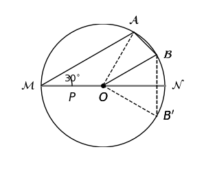

**Analysis:**

Reflect point $B$ across line $MN$ to get point $B'$, and connect $AB'$. By the property of axial symmetry, $AB'$ represents the minimum value of $PA + PB$. Based on the relationship between the central and inscribed angles subtended by the same arc:

$\angle AON = 2 \angle AMN = 2 \times 30^{\circ} = 60^{\circ}$

By symmetry, $\angle B'ON = \angle BON = 30^{\circ}$, so the measure of $\angle AOB'$ can be found. Then apply the Pythagorean theorem to solve.

**Solution:**

Reflect point $B$ across $MN$ to get $B'$, connect $OA$, $OB$, $OB'$, and $AB'$. The intersection of $AB'$ and $MN$ gives the location of point $P$, and the length $AB'$ is the minimum value of $PA + PB$.

- $\because \angle AMN = 30^{\circ}$
- $\therefore \angle AON = 2\angle AMN = 2 \times 30^{\circ} = 60^{\circ}$
- $\because$ arc $AN$ is twice arc $BN$
- $\therefore \angle BON = \frac{1}{2} \angle AON = \frac{1}{2} \times 60^{\circ} = 30^{\circ}$
- By symmetry, $\angle B'ON = \angle BON = 30^{\circ}$
- $\therefore \angle AOB' = \angle AON + \angle B'ON = 60^{\circ} + 30^{\circ} = 90^{\circ}$
- $\therefore \triangle AOB'$ is an isosceles right triangle
- $\therefore AB' = \sqrt{2} \ OA = 2 \sqrt{2}$

Therefore, the minimum value of $PA + PB$ is $2 \sqrt{2}$.

Thus, the answer is $2 \sqrt{2}$.