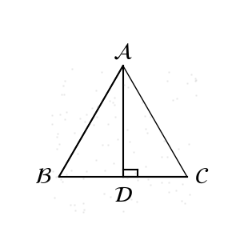

**Analysis:**

Let $AB = x$ cm, then $AC = AB = x$ cm, and $BC = (36 - 2x)$ cm.

Calculate $BD = DC = \dfrac{1}{2} BC = (18 - x)$ cm.

In right triangle $ABD$, by the Pythagorean theorem, we have:

$$
x^2 = 12^2 + (18 - x)^2
$$

Solving gives $x = 13$, that is, $AB = 13$ cm, $BD = 5$ cm.

---

**Solution Explanation:**

Let $AB = x$ cm, then $AC = AB = x$ cm, and $BC = (36 - 2x)$ cm.

Since $AB = AC$ and $AD$ is the altitude,

So $BD = DC = \dfrac{1}{2} BC = (18 - x)$ cm.

In right triangle $ABD$, by the Pythagorean theorem:

$$
AB^2 = AD^2 + BD^2
$$
That is,
$$
x^2 = 12^2 + (18 - x)^2
$$

Solving gives $x = 13$.

So $AB = 13$ cm, $BD = 5$ cm.

Thus $\cos B = \dfrac{BD}{AB} = \dfrac{5}{13}$.

Therefore, the answer is D.